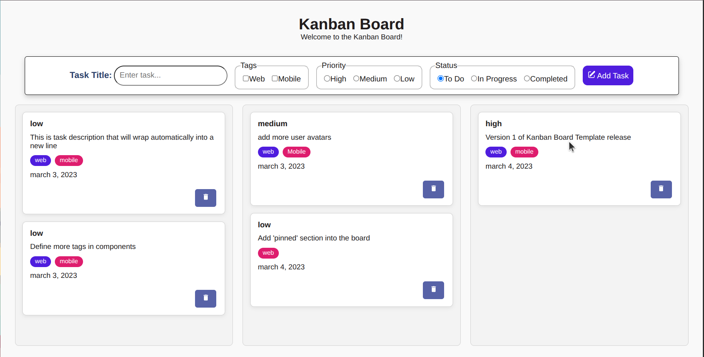

# 📋 Kanban Board

> A fully responsive, dynamic task management application built from scratch with vanilla HTML, CSS, and JavaScript.  
> **Created by Ehtisham Mubasher**

[](https://github.com/EhtishamMubasher/kanban-board)
[](https://developer.mozilla.org/en-US/docs/Web/JavaScript)
[](https://developer.mozilla.org/en-US/docs/Web/CSS)
[](https://developer.mozilla.org/en-US/docs/Web/HTML)

---

## 📖 Table of Contents

- [Overview](#-overview)
- [Features](#-features)
- [Demo](#-demo)
- [Tech Stack](#-tech-stack)
- [Project Structure](#-project-structure)
- [Installation & Setup](#-installation--setup)
- [How to Use](#-how-to-use)
- [Roadmap](#-roadmap)
- [Contributing](#-contributing)
- [License](#-license)
- [Acknowledgments](#-acknowledgments)

---

## 🎯 Overview

This is my **first dynamic web project**, built to solidify my understanding of core JavaScript concepts including DOM manipulation, event handling, array methods, and data‑driven rendering.  

The application allows users to organize tasks across three workflow stages:

- **To Do** – tasks that are planned but not yet started.
- **In Progress** – tasks currently being worked on.
- **Completed** – finished tasks.

---

## ✨ Features

| Feature                 | Description |
|-------------------------|-------------|
| ➕ **Add Tasks**         | Create new tasks with a title, priority, tags, and status. |
| 🏷️ **Tagging System**    | Categorize tasks as `Web` or `Mobile` using checkboxes. |
| 🔴 **Priority Levels**   | Assign `High`, `Medium`, or `Low` priority using radio buttons. |
| 📋 **Dynamic Columns**   | Tasks automatically render into the correct column based on status. |
| 🗑️ **Delete Tasks**      | Remove unwanted tasks with a single click. |
| ✅ **Form Validation**    | Prevents adding empty tasks with a user‑friendly alert. |
| 📱 **Responsive Design** | Adapts to any screen size – grid collapses to a single column on mobile. |
| ♿ **Accessibility**      | Includes `aria-label`, `aria-hidden`, and semantic HTML elements. |

---

## 🖥️ Demo



## 🛠️ Tech Stack

| Technology | Purpose |
|------------|---------|
| **HTML5**  | Semantic markup with `<fieldset>`, `<legend>`, and accessible forms. |
| **CSS3**   | Custom properties (`:root`), CSS Grid, Flexbox, and responsive media queries. |
| **Vanilla JavaScript (ES6)** | Data‑driven rendering, event delegation, array methods (`filter`, `map`, `findIndex`), and dynamic DOM creation. |

No frameworks, no libraries – just pure web fundamentals. 🚀

---

## 📂 Project Structure

```
kanban-board/
├── index.html          # Main HTML file containing the board structure
├── style.css           # All custom styling (variables, layout, card design)
├── script.js           # Core logic (data store, render functions, event handlers)
├── assets/             # Icons and images
│   ├── add.svg         # Plus icon for the Add button
│   └── delete.svg      # Trash icon for the Delete button
└── README.md           # This documentation file
```

---

## 🔧 Installation & Setup

This is a static project – no build tools, package managers, or servers are required. Follow these steps to run it locally:

### 1. Clone the repository
```bash
git clone https://github.com/your-username/kanban-board.git
```

### 2. Navigate to the project folder
```bash
cd kanban-board
```

### 3. Open the application
Simply double‑click `index.html` or open it with your favorite browser.

> 💡 **Pro Tip**: Use the **Live Server** extension in VS Code for a smoother development experience with auto‑refresh.

---

## 🎮 How to Use

1. **Fill out the form** at the top of the page:
   - Enter a **Task Title** (required).
   - Check the appropriate **Tags** (`Web` / `Mobile`).
   - Select a **Priority** (`High` / `Medium` / `Low`).
   - Choose the initial **Status** column (`To Do`, `In Progress`, or `Completed`).

2. Click the **Add Task** button.

3. The new task card will instantly appear in the selected column.

4. To remove a task, click the **Delete** (trash icon) button on the task card.

---

## 🗺️ Roadmap

This project is actively evolving. Here are the features I plan to add next:

- [ ] **Persistent Storage** – Save tasks to `localStorage` so data survives page refreshes.
- [ ] **Drag & Drop** – Enable moving tasks between columns using the HTML5 Drag & Drop API (or SortableJS).
- [ ] **Visual Priority Indicators** – Add color‑coded borders (Red for High, Yellow for Medium, Green for Low) for better scannability.
- [ ] **Edit Tasks** – Allow users to click on a task to edit its title, priority, or tags.
- [ ] **Robust Tag Styling** – Refactor CSS to use data attributes instead of `:first-child` / `:last-child` for more reliable styling.
- [ ] **Empty State Messaging** – Show a friendly message in columns that have no tasks.
- [ ] **Task Counters** – Display the number of tasks in each column.

---

## 🤝 Contributing

This is a personal learning project, but feedback and suggestions are always welcome!  

If you have ideas for improvement:

1. Fork the repository.
2. Create a new branch (`git checkout -b feature/amazing-feature`).
3. Commit your changes (`git commit -m 'Add some amazing feature'`).
4. Push to the branch (`git push origin feature/amazing-feature`).
5. Open a Pull Request.

Alternatively, feel free to [open an issue](https://github.com/EhtishamMubasher/kanban-board/issues) with your suggestions.

---

## 📝 License

This project is open source and available under the [MIT License](LICENSE).  
You are free to use, modify, and distribute it for personal or commercial purposes.

---

## 🙏 Acknowledgments

- Inspired by the classic Kanban methodology for project management.
- Icons provided by [Heroicons](https://heroicons.com/) (or your preferred icon set).
- Built as part of my web development learning journey – special thanks to the developer community for endless inspiration.

---

⭐ **If you found this project helpful or interesting, don't forget to give it a star!** ⭐

---

*Made with ❤️ by [Ehtisham Mubasher](https://github.com/EhtishamMubasher)*
